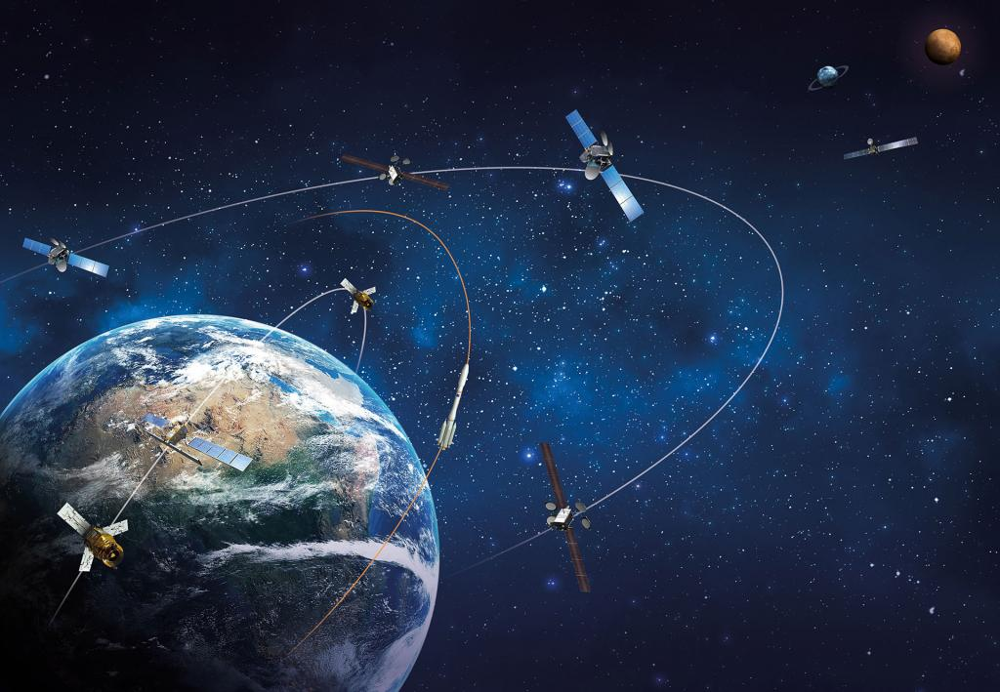

<!DOCTYPE html>
<html lang="en">
        <head>
                <meta charset="UTF-8">
		<link rel="stylesheet" href="page.css">
		<title>Satellite Tracking</title>
        </head>
        <body>
                

			<a href="#Home">Home</a>
			<a href="#Features">Features</a>
			<a href="#About">About</a>
		

		

			<h1>Satellite Tracking</h1>
			
An API for satellite Tracking that users can use to retrieve a specific velocity and position of satellite at specific time

			
		

		

			<h1>Features</h1>
			<ul>
				<li>Local Database</li>
				
				<h3>Description:</h3>
				
store active satellites and will be updated by External Api

				<li>Predicting Satellite Position and Velocity at current time zone</li>
				
				<h3>Description:</h3>
				
predict satellite position and velocity at current time according to africa/cairo time zone

				<li>Predicting Satellite Position and Velocity at future time</li>
				
				<h3>Description:</h3>
				
predict satellite position and velocity at future time according to africa/cairo time zone

		

                

			<h1>About</h1>
				

				I have a bachelor degree in astrophysics, when i have train in Egyptian Space Agnecy we have been asked to build a system that monitor Tiba-1 satellite 
				why we need to do this?? because we have thousands of debris around earth that obstacle active satellites and any collisin could happen. This project is just a
				scenario of satellites how monitord to prevent any collison happen. Please note that this is a theoritical calculations based on orbit model and the actual tracking obtained using a worldwide arrangement of radar tracking stations. i really wish that one day we could get rid of debris around earth.
				
  
                

		<ul>
			<li><a href="https://www.linkedin.com/in/aalaa-mohammed-927a99281/">Linkedin</a></li>
			<li><a href="https://x.com/alaamglal">Twitter</a></li>
			<li><a href="https://github.com/AALAA117">Github</a></li>
			<li><a href="https://github.com/AALAA117/Satellite_Tracking">Project Repo</a></li>
        </body>
</html>
